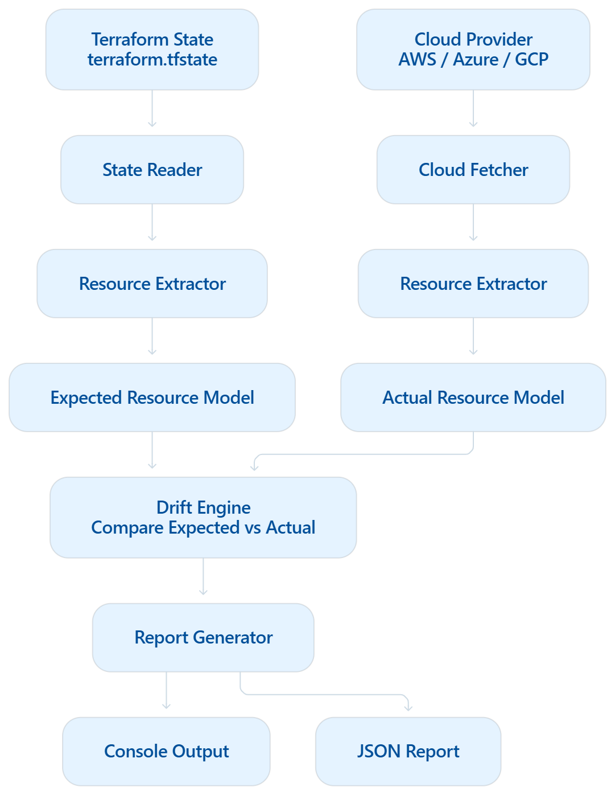

Build a Terraform Drift Detection platform that continuously compares Terraform state files against actual cloud infrastructure to identify configuration drift.

The system retrieves expected resource metadata from Terraform state and actual resource metadata from cloud provider APIs, normalizes both into a common model, and highlights differences such as deleted resources, modified attributes, and tag changes.

Users can run scans on demand or on a schedule and view drift reports through a simple dashboard, CLI, or JSON output.

The solution should be cloud-agnostic, extensible, and optimized for fast infrastructure visibility without requiring Terraform plan or apply operations.

Let's create a plan first.

